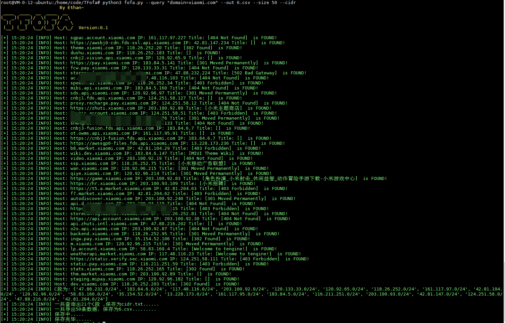

# TFofa
一个使用Fofa API查询的小工具,支持cidr导出。


## 声明

使用TFofa前请遵守当地法律,TFofa仅提供给教育行为使用。

## 使用

### 安装
安装TFofa需要依赖Python3.6 以上环境.
```bash
git clone https://github.com/Ethancck/TFofa.git
cd TFofa # 进入git目录
pip3 install -r requirements.txt
python3 fofa.py -h
```
### 查询
```
python3 fofa.py --query "your words" --out 6.csv --size 50   #使用out参数把查询结果输出到文件
```
### 导出查询到的C段
使用--cidr命令
```
python3 fofa.py --query "your words" --out 6.csv --size 50 --cidr #把C段导出为cidr.txt
```


## 贡献&感谢
- @Ethan
